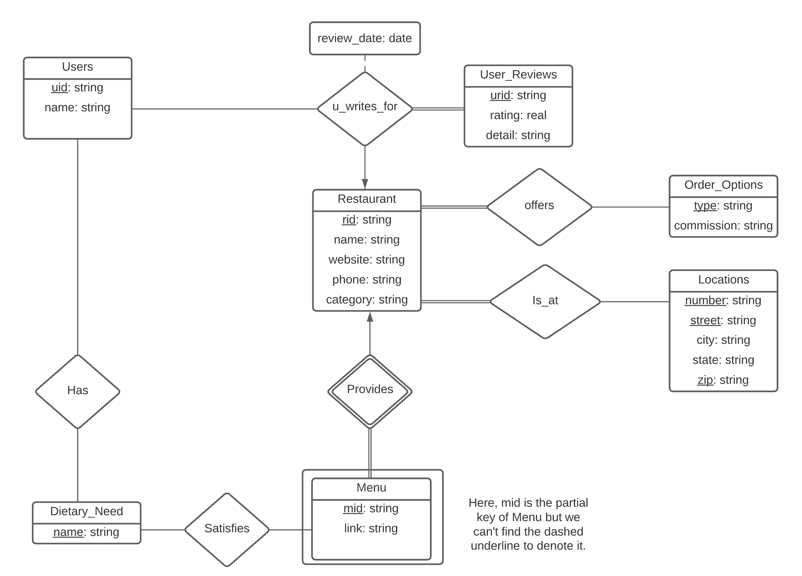

This project is for CS4111 Introduction to Databases (Fall 2020) at Columbia University.

In the project, we designed the database, populated it with realistic data, and built a web front-end where users can perform complex queries.

## Code organization

The project is split into three parts: part 1 which includes the proposal and ER diagram for the database, part 2 which includes the SQL schema, web-scraping scripts that were used to get real/realistic data that populates the database, and some interesting queries, part 3 which includes the web front end that allow users to perform queries on the database without the need to write any SQL commands.

* [./docs/Part_1.pdf](./docs/Part_1.pdf) gives the proposal of this project which includes the overall design of the database, the source of data that we plan to use to populate the database, the expected user interaction, and a contingency plan.
* [Webscraping_SQL_Queries.ipynb](Webscraping_SQL_Queries.ipynb) is the python script that gets data using the google place api, and convert the parsed data into SQL insertion commands.
* [./docs/Part_2.pdf](./docs/Part_2.pdf) gives the SQL schema and some interesting queries.  
* [./templates/](./templates/) are the html templates we used for the web front end.
* [server.py](server.py) is a simple webserver for the web front end.

## Details about the project

### ER Diagram

### Getting data using the google api

Simply download the python notebook and follow the instructions inside.

### Running the Server

You can run the server locally by typing

    python server.py

Then go to http://localhost:8111 in your browser.

## Final report for the project 

### PostgreSQL account 

psql -U xw2767 -h 34.75.150.200 -d proj1part2  
Password: 7210

### URL of my web applicationL

http://34.74.3.37:8111/ (This app is archived and no longer accessible over the internet.)

### What is implemented

Our application does take a user’s input of information about the restaurant and return all restaurants (limit 20 here) that satisfies the user’s input and take a user’s input of a restaurant name and return all details we have on that restaurant. For example, a user specifies a restaurant category (we have Japanese, Italian, American, Chinese, Mexican, Indian in our database), our application will return restaurants that match the user’s inputs if we have them in the database. If we don’t we’ll let the user know that there’s no restaurant that matches the specified requirements. 

The user can also search for dietary needs and we’ll return 20 restaurants that satisfy the needs (ex. Vegan). If the user’s input is a restaurant name, our application will return all the details of that restaurant, such as order options (Dine-in, take-out, delivery, etc), menus, location, recent user reviews and employee reviews. Users of our database will also be able to write reviews for restaurants, which will be stored in the database.

Furthermore, we enable the user to run advanced queries in our web application so that users can search for restaurants using multiple restrictions.
    
### What is not implemented:

Location query (for instance, “70 Morningside Dr”): We've limited our database to restaurants around Columbia University so we find the location query redundant. Thus we did not implement it. However, user can still find location to restaurants they like when they search for details of a specific restaurant. 

The user will not see the price level of each restaurant: A majority of the restaurants did not have price level associated with them when we conducted the API requests.

Each order option shows no different commission fees (this is for the option of delivery): We feel this could be ignored since there are only a few popular delivery apps and users don't really care about the commission fees.

### Interesting queries that can be performed on the web fron end

In the advanced search page [./templates/advquery.html](./templates/advquery.html), user can search for restaurants with multiple constraints. For instance, they can search for all Japanese restaurants that offer take-out and Vegan dishes that also have ratings above 4. 

Also, [./templates/index.html](./templates/index.html) has an interesting function that can do a database operation that query restaurant reviews containing certain text. The function created in [server.py](server.py) gives the detailed database operations using engine and sql query. Then [./templates/query.html](./templates/Query.html) displays the results from the database operations conducted by server.py.

## Result

The project was graded <b>99.5/100</b> which is one of the highest scores in class. We are quite satisfied with the result. In second half of the class, we expanded our project [./docs/Expansion.pdf](./docs/Expansion.pdf) by adding a composite type "event" and a trigger to enforce the total participation constraints. We also explored more topics in database systems such as query optimization. 
